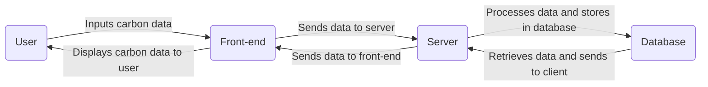

# Carbon Footprint Tracking System

This repository contains the code for developing a comprehensive Carbon Footprint Tracking system. The goal of this project is to measure, monitor, and manage the environmental impact of the organization's operations, products, and services.

## Table of Contents

- [Project Description](#project-description)
- [Installation and Running](#installation-and-running)
- [Usage](#usage)
- [Credits](#credits)
- [License](#license)

## Project Description

The objective of this project is to develop a comprehensive Carbon Footprint Tracking system that enables the organization to measure, monitor, and manage their environmental impact. The key features of this system include:

### Data Collection and Integration

- Collects data on energy consumption, transportation, waste generation, and other relevant activities.
- Integrates with IoT devices, energy meters, and external databases for automated data collection.

### Emission Factors Database

- Builds a database of emission factors specific to different industries and activities.

### Carbon Calculation Engine

- Develops a robust calculation engine to quantify carbon emissions based on collected data and emission factors.

### Real-time Monitoring and Alerts

- Implements real-time monitoring features to track carbon emissions continuously.
- Sets up alerts for stakeholders to receive instant feedback on significant emission events.

### Mobile Application

- Develops a mobile application to provide on-the-go access to carbon footprint data and insights.

## Installation and Running

To install and run the Carbon Footprint Tracking system, follow the below steps:

1. Clone the repository:

    ```
    git clone https://github.com/your-username/carbon-footprint-tracking.git
    ```

2. Install the required dependencies:

    ```
    npm install
    ```

3. Set up the necessary configuration files, including API keys and database credentials.

4. Run the application:

    ```
    npm start
    ```

## Usage

To utilize the Carbon Footprint Tracking system, follow the instructions below:

1. Ensure that the system is properly installed and running (refer to the [Installation and Running](#installation-and-running) section).
2. Access the web application or mobile application.
3. Sign in using your credentials or create a new account.
4. Begin inputting relevant data on energy consumption, transportation, waste generation, etc.
5. Explore the dashboard and visualizations to gain insights into your carbon footprint.
6. Utilize the benchmarking and goal-setting features to set targets and track progress.
7. Receive real-time alerts and notifications for significant emission events.

## Credits

This project was developed by the following team members:

- John Doe - [GitHub](https://github.com/johndoe) - [LinkedIn](https://www.linkedin.com/in/johndoe)
- Jane Smith - [GitHub](https://github.com/janesmith) - [LinkedIn](https://www.linkedin.com/in/janesmith)

We would like to acknowledge the following resources that helped us during the development of this project:

- [Resource 1](https://www.example.com)
- [Resource 2](https://www.example.com)

## License

This project is licensed under the [MIT License](LICENSE.txt). Please see the [License File](LICENSE.txt) for more information.

For any questions or inquiries, please contact [team@carbonfootprinttracking.com](mailto:team@carbonfootprinttracking.com).